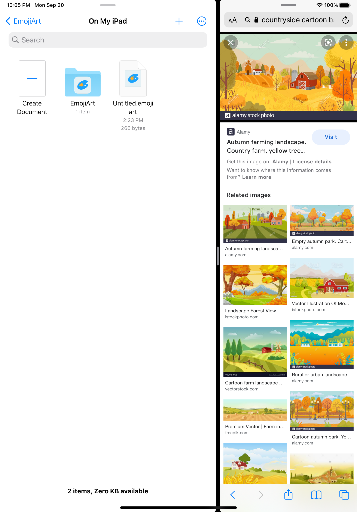
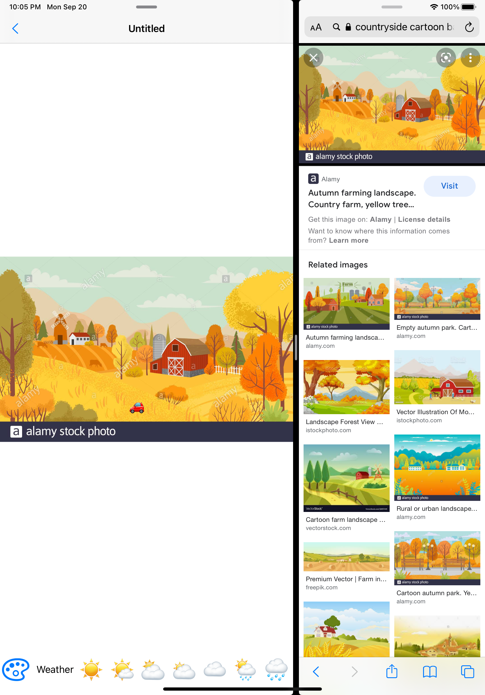
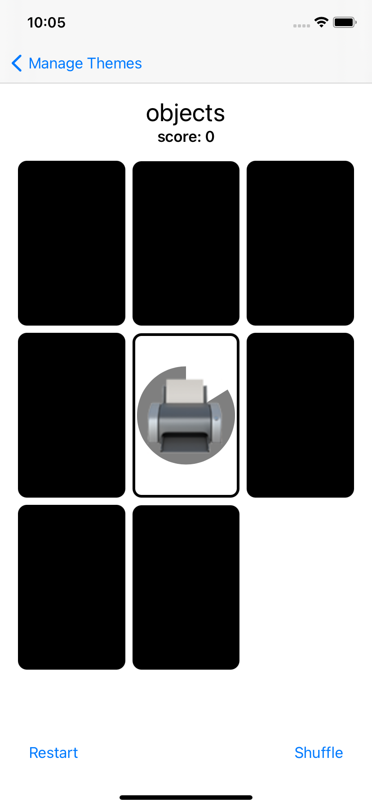
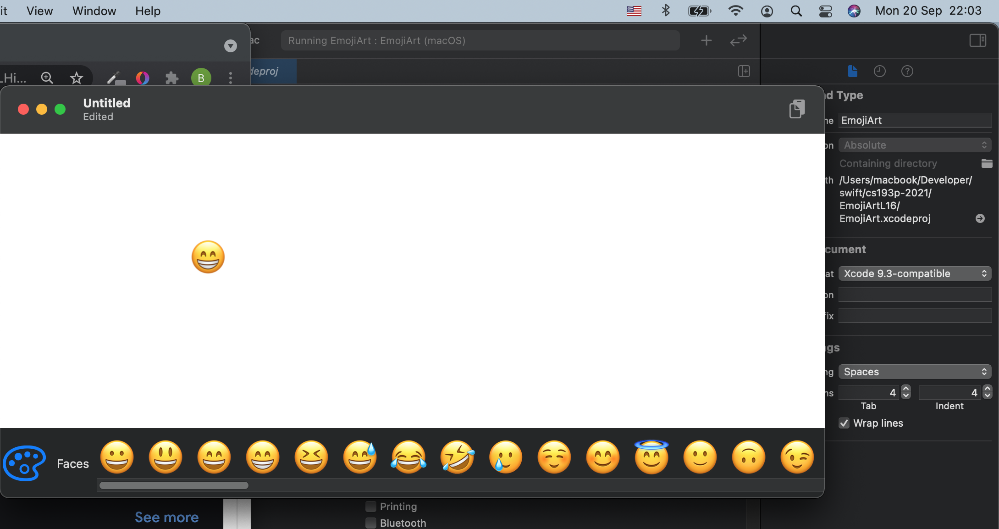

# Files for Developing Applications for iOS using SwiftUI [cs193p] course

Study material for the course Developing Applications for iOS using SwiftUI given by Paul Hegarty at Stanford University in Spring 2021. This repo contains code-alongs of all lectures as well as completed assignment tasks (spread through projects, you can find them by deltas and commits if needed)

## Contents

### iOS applications

During this course several iOS applications were developed such as Memorize game, Set game, and EmojiArt using SwiftUI with small inclusion of old UIKit. Those apps cover following concepts:
* Document-based apps
* JSON persistance
* Asynchronous programming
* Gestures

  
  
  

### macOS application

Another concept that was covered is multiplatform capabilities of SwiftUI through conversion of the EmojiArt app to the macOS application.

  

## Useful links

* [Course materials](https://cs193p.sites.stanford.edu/)
